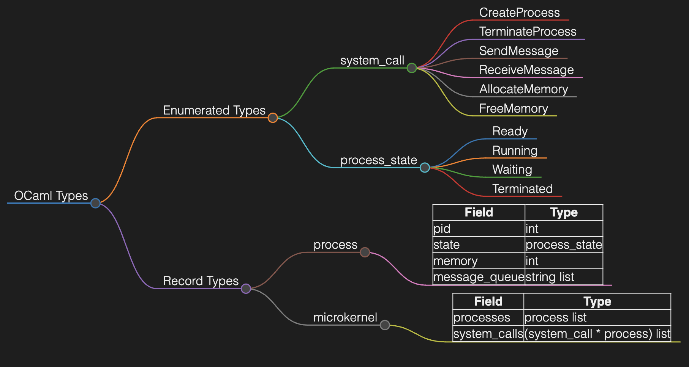
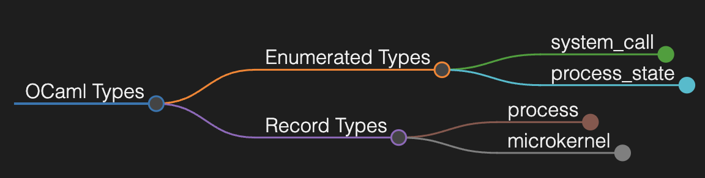

# OCaml Types to Markdown (OCaml_Types_to_MD)

This repository provides a tool to convert OCaml types to a Markdown format that can be visualized using the Markmap extension in Visual Studio Code (VSCode).

## Steps to Use

1. **Install Markmap Extension**
   - Open VSCode.
   - Go to the Extensions view by clicking the Extensions icon in the Activity Bar on the side of the window or by pressing `Ctrl+Shift+X`.
   - Search for "Markmap" and install the Markmap extension from the VSCode Marketplace.

2. **Prepare Your OCaml Types**
   - Create a separate file named `type.ml` to store your OCaml types.

3. **Generate Markdown File**
   - Run the `ocaml_to_md.py` script. This script will read the `type.ml` file and generate a corresponding `type.md` file.
   - You can then open the `type.md` file in VSCode and use the Markmap extension to visualize the types.

## Example

Suppose you have the following OCaml types defined in `type.ml`:

```ocaml
(* Enumerated type to represent different system calls *)
type system_call =
  | CreateProcess
  | TerminateProcess
  | SendMessage
  | ReceiveMessage
  | AllocateMemory
  | FreeMemory

(* Enumerated type to represent different states of a process *)
type process_state =
  | Ready
  | Running
  | Waiting
  | Terminated

(* Record type to represent a process in the system *)
type process = {
  pid: int;
  state: process_state;
  memory: int; (* Amount of memory allocated to the process *)
  message_queue: string list; (* Queue of messages for IPC *)
}

(* Record type to represent the microkernel *)
type microkernel = {
  processes: process list;
  system_calls: (system_call * process) list;
}

```

Running the `ocaml_to_md.py` script will generate a `type.md` file with a Markdown representation of these types. Open `type.md` in VSCode and use the Markmap extension to view a mind map of your OCaml types.



We can easily expand/un-expand the map. 




